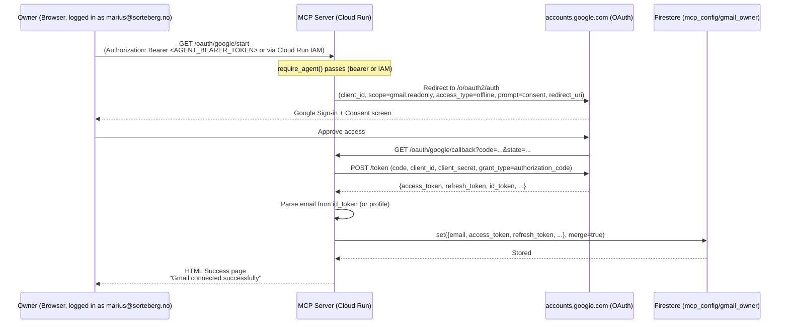
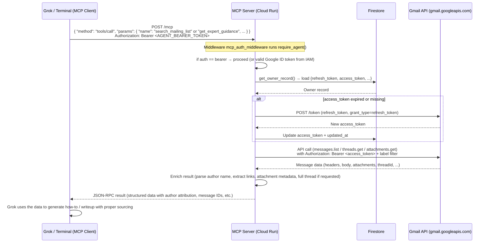

# Sorteberg MCP Architecture

## High-Level Overview

The Sorteberg MCP is a remote Model Context Protocol server that gives AI agents (primarily Grok) controlled, read-only access to specific Gmail labels containing valuable technical mailing list archives.

Instead of the AI having direct Gmail access, it gets a curated set of tools that can search, retrieve threads, attachments, and external links — all while the owner’s credentials stay safely on the server.

## Core Components

### 1. Gmail Integration Layer
- Uses `google-api-python-client` + OAuth2 with refresh tokens.
- Owner performs one-time OAuth flow via `/oauth/google/start`.
- Refresh tokens + access tokens are stored in **Google Cloud Firestore** (collection `mcp_config`, document `gmail_owner`).
- Automatic token refresh happens transparently in `get_gmail_service()`.
- All searches are hard-restricted to a whitelist of labels (`ALLOWED_LABELS`).

### 2. MCP Tool Layer (FastMCP)
Tools are defined with the `@mcp.tool()` decorator. The server exposes them through two transports:

- **Primary (recommended)**: Official `streamable-http` transport mounted at `/mcp`.
- **Legacy**: Custom JSON-RPC 2.0 handler at `/mcp-legacy` (and root) for clients that speak the older protocol.

Key tools (as of latest version):
- `search_mailing_list` — rich search with author, date, attachment filters.
- `get_message` / `get_thread` — full content + context.
- `get_attachment` — with PDF text extraction.
- `fetch_link` — follow URLs mentioned in messages.
- `get_expert_guidance` — high-level tool that performs smart multi-query search + thread fetching, optimized for generating how-to documents.
- Plus supporting tools for authors, links, etc.

All results are designed to be rich in attribution (author name/email, date, message/thread IDs, source label).

### 3. Authentication Layers (Defense in Depth)
1. **Cloud Run IAM** (`--no-allow-unauthenticated` + `roles/run.invoker`)
   - Controls who can even reach the service.
   - Owner (`marius@sorteberg.no`) has explicit invoker rights.
   - Can be opened to `allUsers` when you want easy bearer-token access for Grok.

2. **Application-level Bearer Token**
   - `AGENT_BEARER_TOKEN` environment variable.
   - Enforced in middleware for all `/mcp*` paths.
   - The custom OAuth flow (`/oauth/authorize` + `/oauth/token`) using "none" (PKCE) hands this token to Grok clients.

3. **Owner Gmail OAuth**
   - Completely separate flow. Only the server ever sees the Gmail tokens.

### 4. Flow Diagrams

#### 4.1 Initial Gmail Owner Authentication Flow (Token Storage in Firestore)

This flow is performed once (or when the owner needs to re-authorize). The goal is for the server to obtain a long-lived `refresh_token` from Google and persist it securely.



Key points:
- The `refresh_token` is only returned on the first consent (or when `prompt=consent` + `access_type=offline`).
- Tokens are stored server-side only.
- The `AGENT_BEARER_TOKEN` (or Cloud Run IAM) protects this endpoint so random visitors can't trigger owner re-auth.

#### 4.2 Regular Tool Usage Flow (in Terminal / Grok)

This is the everyday flow when you (or Grok in the terminal/web) use the MCP tools.



Key points:
- The client (Grok) never sees Gmail tokens — only the results of tool calls.
- Token refresh is fully automatic and transparent.
- All results include author name/email and source identifiers so Grok can attribute advice correctly.
- The same bearer token (obtained via the PKCE "none" flow during Custom Connector setup) is used for every call.

## Using the MCP from the Grok Web Client

The Sorteberg MCP is designed to integrate directly with the Grok web client (at grok.x.ai or via the X platform) using the built-in Custom Connectors feature. This allows Grok to discover and call your mailing list search tools natively during conversations, without any manual copying of emails or tokens.

### Adding the Custom Connector

1. In the Grok web interface, go to the settings or connectors section and select the option to add a new Custom Connector (sometimes labeled as "MCP server" or "Custom tool provider").

2. Enter a descriptive name for the connector, such as "Sorteberg Merak Gmail MCP".

3. Set the MCP server URL to the primary endpoint that serves the official streamable-http transport:
   ```
   https://<your-deployed-service-domain>/mcp
   ```
   (This is the path where the FastMCP tools are exposed for modern clients like Grok.)

4. Since tool access requires authentication, the connector will prompt for OAuth credentials. Configure it using the "none (PKCE only, recommended)" token auth method:
   - Provide the Authorization Endpoint and Token Endpoint from your MCP server (these endpoints are hosted on the same service and support public client flows).
   - Client Secret can be left empty.
   - Scopes can typically be left blank or set to a minimal value like "mcp" if required by the form.

5. Save the connector and complete the OAuth authorization flow when prompted. Grok will handle obtaining the necessary access credentials through this flow.

Once added, Grok will automatically probe the connector (using standard MCP discovery methods like `tools/list`) and make the available tools visible in your conversations.

### Available Tools and How Grok Uses Them

After a successful connection, the following tools from your MCP become available for Grok to use automatically or on request:

- `search_mailing_list` — for querying emails in your allowed labels with flexible filters.
- `get_expert_guidance` — a specialized tool that retrieves enriched, expert-sourced discussions suitable for building how-tos.
- Supporting tools such as `get_message`, `get_thread`, `list_attachments`, `get_attachment`, `extract_links`, `fetch_link`, `search_by_author`, and `list_labels`.

Grok can call these tools in the background when you reference your connected data. For example, it might use `search_mailing_list` with a query focused on your "Merak Group" label, then follow up with `get_thread` or `get_expert_guidance` to gather full context and author-attributed advice.

### Example Usage in Grok Conversations

You can prompt Grok directly in the web client to leverage the MCP:

- "Using my Sorteberg MCP (Merak Group label), search for expert discussions on overhauling the engine and create a detailed, step-by-step how-to guide with tips, warnings, and attributions to specific posts or authors from the list."
- "From the connected mailing list tools, pull the best advice on gearbox issues and format it as a troubleshooting guide with sources."
- "Help me generate a comprehensive writeup on headlight hydraulics by querying the MCP tools for relevant threads and attachments."

Grok will handle tool selection, parameter construction (including label restrictions), and synthesis of the results into a coherent response. You don't need to know the exact tool names or query syntax — natural language is usually sufficient, especially when you mention "my MCP", "Sorteberg connector", or the specific label.

### Best Practices and Notes

- Be specific in your prompts about the label (e.g., "Merak Group") and the type of output you want (structured steps, expert quotes, warnings, etc.). This helps Grok choose the right tools and parameters.
- The MCP connection gives Grok read-only access only to the results of the tools — your actual email content and Gmail credentials remain on the server side and are never exposed.
- If tools don't appear immediately after adding the connector, try starting a new conversation or refreshing the page. You can also ask Grok explicitly: "List the tools available from my Sorteberg MCP connector."
- The connector uses the modern MCP transport, so Grok gets full support for the rich tool schemas (including descriptions that help it decide when and how to call each one).
- For ongoing use, the connection persists across sessions. You can manage or remove the connector from Grok's settings at any time.
- If you need to re-authorize the connector (e.g., after token expiration), simply re-run the OAuth step in the connector configuration.

This setup turns your unstructured email archives into a live, queryable knowledge source that Grok can consult directly in the web interface for tasks like research, troubleshooting, or creating detailed technical documentation based on real expert input from the mailing lists.

### 5. Web Layer (FastAPI)
- Health check, root info page, debug endpoints.
- Owner OAuth flow for Gmail.
- Minimal OAuth2 endpoints to satisfy Grok’s “Custom Connector” OAuth (PKCE none) wizard so it can obtain the bearer token.
- Middleware that applies bearer checks to MCP paths.

### 6. Deployment
- Dockerfile based on Python slim image.
- Deployed via `gcloud run deploy --source=.` (Cloud Run source deployer builds the image).
- Environment managed via `env-vars-file` (contains non-sensitive values + the agent bearer).
- Secrets (Gmail client ID/secret) are currently in the env file — in a real production setup they should move to Secret Manager.

## Data Flow for a Typical "Create How-To" Request

1. User (in Grok web) asks something like: "Using the Merak Group list, create a complete guide for overhauling the engine with tips from the experts."
2. Grok decides to call `get_expert_guidance` (or a combination of `search_mailing_list` + `get_thread`).
3. Request goes to the MCP server (authenticated with the bearer token obtained during connector setup).
4. Server calls Gmail API (using the stored owner refresh token).
5. Results are returned with full attribution.
6. Grok synthesizes a high-quality, sourced document and presents it to the user.

The AI never sees raw Gmail credentials or has unrestricted access.

## Design Decisions & Trade-offs

- **Why Firestore instead of Secret Manager for tokens?**  
  Simpler for a single owner. Easy to implement refresh logic. Can be upgraded later.

- **Why both streamable-http and legacy JSON-RPC?**  
  Maximum compatibility. Grok web prefers the modern transport; older clients or direct testing can use the JSON-RPC path.

- **Why a high-level `get_expert_guidance` tool?**  
  Searching a mailing list for "how to" content is a common pattern. Having a tool that does smart query expansion + thread fetching saves many round-trips and produces better context for the LLM.

- **Why allow-unauthenticated + bearer?**  
  Makes it trivial for Grok (and other external agents) to use the server. The bearer is still a secret. For maximum security you can lock it back to pure IAM and have Grok use a properly authorized Google identity.

## Current Limitations & Future Ideas

- Full email bodies and threads can get large — we truncate aggressively in some places.
- No semantic/vector search yet (keyword + Gmail search only).
- Image attachments are returned as metadata only (vision can be done on the client side or via a future tool).
- No write access to Gmail (by design).
- No persistent indexing of the archive (every search hits Gmail API).

Possible future enhancements:
- Background indexing + vector embeddings of threads.
- Dedicated "knowledge base" tools.
- Image description tool using a vision model.
- Export generated guides as Markdown/PDF and attach them back to Gmail or a wiki.
- Multi-user support (multiple owners, per-user labels).

## Security Considerations

- Least privilege on Gmail (readonly scope only).
- Tokens never leave the Cloud Run service.
- App-level auth on top of platform auth.
- Owner can revoke access at any time via Google Account settings.

This architecture gives you the convenience of a powerful personal knowledge base while keeping strong boundaries between your private email and the AI.